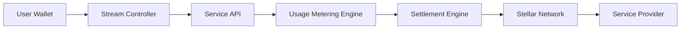
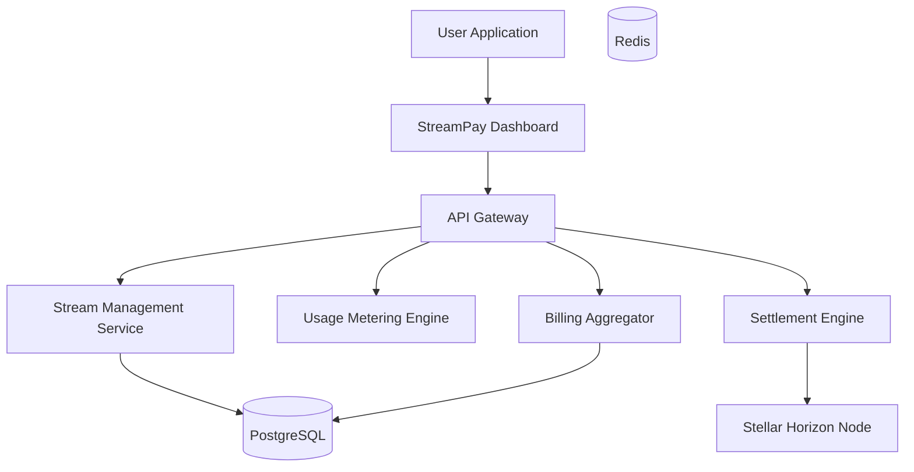
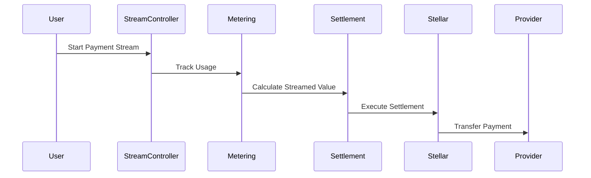
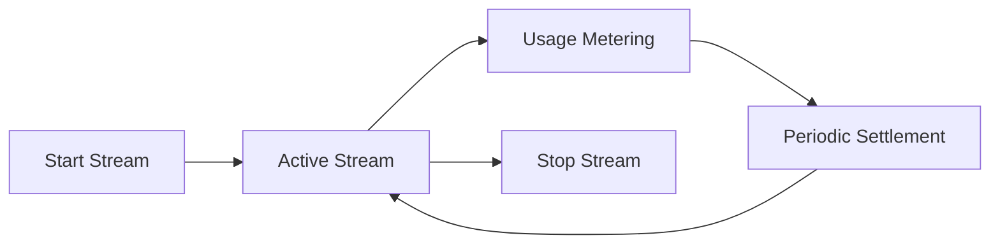
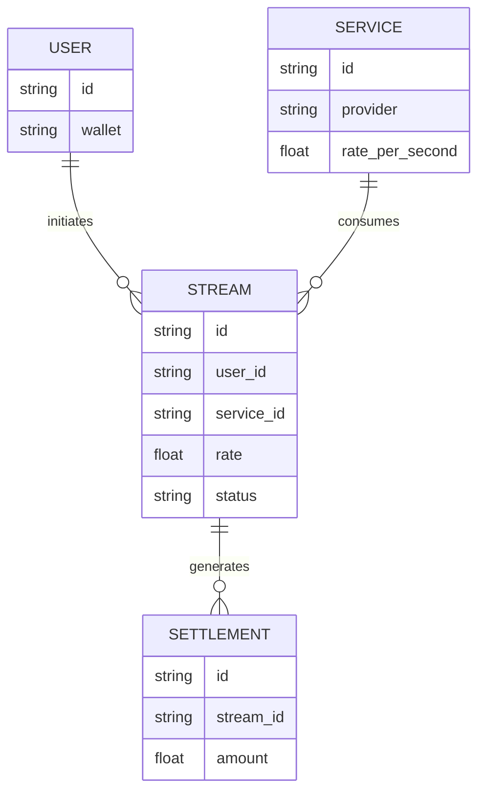

# StreamPay  
### Payment Streaming

StreamPay is a **real-time payment streaming protocol built on the Stellar network** that enables continuous, programmable payments between parties.

Unlike traditional payments that occur as discrete transactions, StreamPay allows funds to **flow continuously over time**, enabling new economic models such as pay-per-second services, real-time infrastructure billing, and autonomous service payments.

The protocol enables businesses and developers to build applications where payments are **metered by usage and settled continuously**.

---

# 1. Problem

Most payment systems today rely on **discrete transactions**.

Examples:

- monthly SaaS billing
- hourly service payments
- prepaid API usage
- subscription plans

However, many modern services operate on **continuous resource consumption**.

### Example Services

| Service Type | Billing Need |
|---------------|--------------|
| AI compute usage | pay per compute second |
| SaaS tools | pay per active usage |
| IoT bandwidth | pay per data usage |
| Cloud infrastructure | pay per CPU / storage second |

Current systems rely on **periodic billing cycles**, which creates inefficiencies.

### Limitations

| Problem | Impact |
|--------|--------|
| Delayed settlements | providers assume payment risk |
| Prepaid balances | inefficient capital usage |
| Complex billing systems | operational overhead |
| Lack of micro-payment infrastructure | limits new business models |

---

# 2. Solution

StreamPay introduces a **continuous payment streaming protocol** built on Stellar.

Instead of sending individual payments, funds are streamed continuously from the payer to the recipient.

### Core Concept

Payments flow based on time and usage.

Example stream: $0.002 per second

Flow: User Wallet → API Provider

The protocol periodically settles accumulated value on-chain.

---

# 3. Key Features

### Continuous Payment Streams

Payments flow continuously based on time.

### Usage-Based Billing

Services can charge users based on resource consumption.

### Programmable Streams

Developers can program payment conditions and limits.

### Micro-Payment Settlement

StreamPay aggregates micro-payments before settling on-chain.

### Automatic Stream Termination

Streams stop automatically when usage ends or balance runs out.

---

# 4. Why Stellar

StreamPay uses the Stellar network because it is optimized for payments.

| Feature | Benefit |
|---------|---------|
| Extremely low fees | enables micro-payments |
| Fast settlement | near-instant confirmations |
| Stablecoin ecosystem | predictable pricing |
| Global accessibility | cross-border usage |

Stellar provides the infrastructure required for **high-frequency payment systems**.

---

# 5. System Architecture

---

# 6. Component Architecture

---

# 7. Payment Streaming Flow

---

# 8. Stream Lifecycle

---

# 9. Data Model

---

# 10. Stream Contract Model

Each payment stream contains the following parameters.

| Field | Description |
|-------|-------------|
| Stream ID | Unique identifier |
| Payer Wallet | Source of funds |
| Recipient Wallet | Service provider |
| Rate | Payment per second |
| Start Time | Stream start |
| End Time | Stream stop |
| Balance | Remaining funds |

---

# 11. Smart Contract Logic

Smart contracts manage streaming payment logic.

Example functions:

- `create_stream(payer, recipient, rate)`
- `start_stream(stream_id)`
- `stop_stream(stream_id)`
- `settle_stream(stream_id)`

Contracts ensure funds are distributed according to the streaming rate.

---

# 12. Tech Stack

**Frontend:** Next.js, React, TailwindCSS, Stellar wallet integration

**Backend:** Golang, Node.js, REST APIs, gRPC microservices

**Blockchain:** Stellar Network, Soroban smart contracts, Stellar SDK, Horizon API

**Infrastructure:** Docker, Kubernetes, PostgreSQL, Redis, AWS / GCP

**Usage Metering:** event streaming, real-time usage tracking, billing aggregation engine

---

# 13. Security Considerations

StreamPay includes several security protections.

| Layer | Protection |
|-------|------------|
| Escrow balances | ensures provider payment |
| Rate validation | prevents malicious streams |
| Usage verification | protects billing integrity |
| Transaction monitoring | detects anomalies |

---

# 14. Revenue Model

StreamPay generates revenue through infrastructure services.

| Revenue Stream | Fee |
|----------------|-----|
| Stream settlement fee | 0.2–0.5% |
| Developer SDK | subscription |
| Enterprise infrastructure | licensing |
| Usage analytics | premium services |

---

# 15. Future Roadmap

**Phase 1:** payment streaming contracts, developer APIs, usage metering

**Phase 2:** streaming payment channels, real-time analytics, service marketplace

**Phase 3:** AI economy integrations, IoT streaming payments, cross-chain payment streams

---

# 16. Potential Impact

StreamPay enables real-time economic interactions between digital services.

Benefits include: fair usage-based pricing, continuous settlement, reduced payment friction, support for autonomous systems.

The protocol could become a core financial infrastructure for the machine economy.

---

# Repository Structure

- **streampay-frontend** – Next.js dashboard and Stellar wallet integration
- **streampay-backend** – Express API, metering, and settlement services
- **streampay-contracts** – Soroban smart contracts for payment streams

---

**License:** MIT
